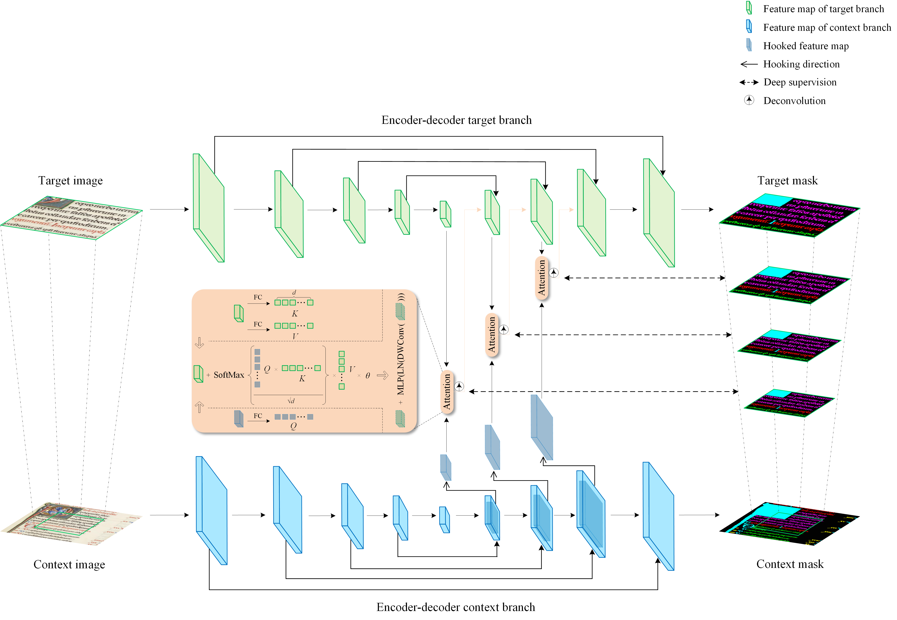

# Light-HookNet

This repository includes the codes for the paper:
 
[**Lightweight Cross-Attention-based HookNet for Historical Handwritten Document Layout Analysis**](https://link.springer.com/article/10.1007/s10032-025-00519-9), accepted by *ICDAR-IJDAR journal track*

$\texttt{Fei Wu, Mathias Seuret, Martin Mayr, Florian Kordon, Jochen Zöllner, Sebastian Wind, Andreas Maier, and Vincent Christlein}$



### Abstract
Handwritten document layout analysis is a fundamental step in digitizing scanned ancient documents for further processing (e.g., optical character recognition). So far, single branch-based fully convolutional networks (FCN) dominate this field. However, we contend that this task faces significant challenges, particularly in layouts with only semantic differences rather than differences in character appearance. For example, in the U-DIADS-Bib dataset, distinguishing between the main text and chapter headings can confuse existing FCNs due to the presence of similar distractors. It is, thus, critical to integrate layout structural information into the network learning processes. Moreover, the single branch-based networks have an upper limit of constructing document contextual relationships. Therefore, we propose a novel two-branch framework, called lightweight cross-attention-based HookNet (Light-HookNet), for handwritten document layout segmentation. The layout contextual information is connected and interacted with the cross-attention mechanism between a global context branch and a local target branch. This allows to achieve information enhancement inside the target branch and information exchange across both branches. Additionally, the reduced network parameters and computational costs make the proposed method both lightweight and efficient. Extensive experimental results and performance comparisons with state-of-the-art approaches on the newly proposed U-DIADS-Bib dataset and the popular DIVA-HisDB dataset demonstrate the superiority and effectiveness of the proposed method.

### Preprocessing
Prepare train/validation/test datasets based on [DIVA-HisDB](https://diuf.unifr.ch/main/hisdoc/diva-hisdb.html) / [U-DIADS-Bib](https://sites.google.com/view/avml-lab-udiadsbib/home), run center_crop.py, Sliding_window_generate_dataset.py, generate_target_context.py accordingly.

### Inference
Please refer to the officially released evaluation tools of [DIVA-HisDB](https://github.com/DIVA-DIA/DIVA_Layout_Analysis_Evaluator) and [U-DIADS-Bib](https://ai4ch.uniud.it/udiadscomp/data.html) for assessing experimental results.

### License
Licensed under an MIT license.

### Citation
If you find this work useful for your research, please cite us:
```bibtex
@Article{Wu2025,
author={Wu, Fei and Seuret, Mathias and Mayr, Martin and Kordon, Florian and Z{\"o}llner, Jochen and Wind, Sebastian and Maier, Andreas and Christlein, Vincent},
title={Lightweight cross-attention-based HookNet for historical handwritten document layout analysis},
journal={International Journal on Document Analysis and Recognition (IJDAR)},
year={2025},
month={Apr},
day={19},
issn={1433-2825},
doi={10.1007/s10032-025-00519-9},
url={https://doi.org/10.1007/s10032-025-00519-9}}

```

